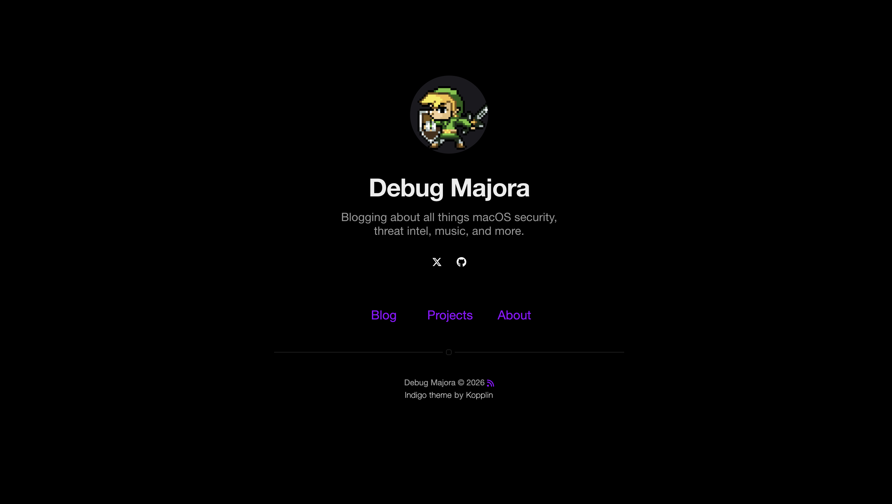

# Debug Majora

This repository contains the source for [Debug Majora](https://debug-majora.github.io), my personal blog where I cover all things macOS security, threat intel, music, and more.

## Preview

## Content Structure

- `_posts/` contains dated articles (standard Jekyll posts)
- `about.md`, `music.md`, `compassion.md`, etc. are standalone pages rendered with the `page` layout
- `_sass/`, `_includes/`, and `_layouts/` hold the Indigo-derived styling and markup customizations
- `assets/` stores images and misc static files referenced across the site

## Credits

The design started from Sergio Kopplin's [Indigo](https://github.com/sergiokopplin/indigo) theme.
